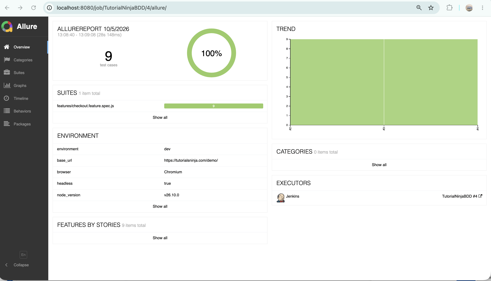
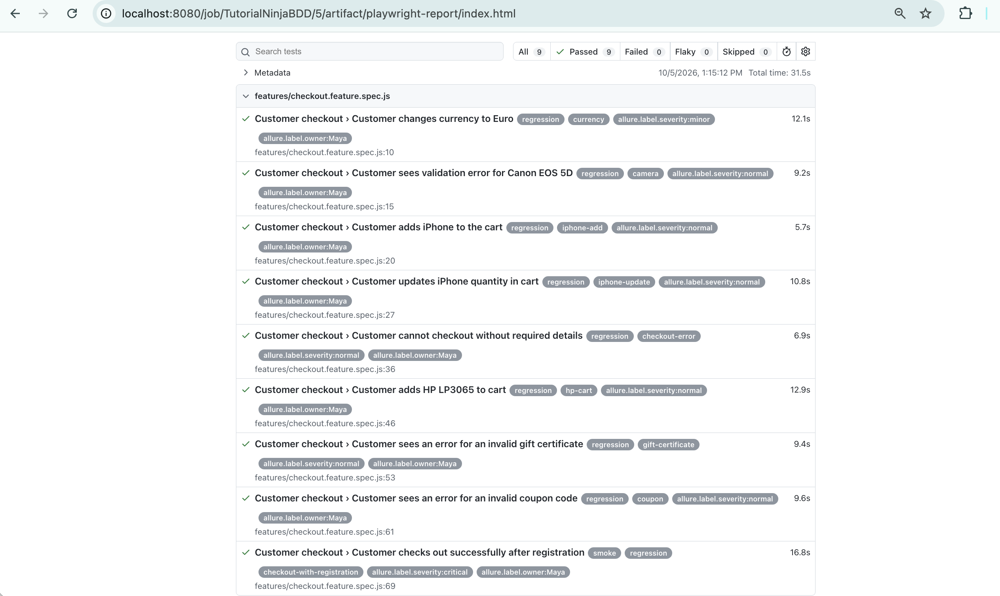

# Tutorial Ninja Playwright BDD

UI test automation framework for the Tutorial Ninja demo store using Playwright, playwright-bdd, Page Objects, Allure reporting, and Jenkins.

## Prerequisites

- Node.js 18+
- npm
- Java JDK (for Allure reports)
- Git

## Install

```bash
git clone [https://github.com/mayababuji/PlaywrightTutorialNinjaBDD.git](https://github.com/mayababuji/PlaywrightTutorialNinjaBDD.git)
cd PlaywrightTutorialNinjaBDD
npm ci
npx playwright install chromium
```

## Environment setup

Create `.env.dev` in the project root:

```env
BASE_URL=[https://tutorialsninja.com/demo/](https://tutorialsninja.com/demo/)
HEADLESS=false
TEST_TIMEOUT=30000
TEST_PASSWORD=your-password
```

Do not commit `.env.dev`.

## Run tests

Generate BDD tests and run all tests:

```bash
TEST_ENV=dev npx bddgen && TEST_ENV=dev npx playwright test
```

Run with the browser visible:

```bash
TEST_ENV=dev npx bddgen && TEST_ENV=dev npx playwright test --headed
```

Run tagged tests:

```bash
# Smoke tests
TEST_ENV=dev npx bddgen && TEST_ENV=dev npx playwright test --grep @smoke

# Coupon test
TEST_ENV=dev npx bddgen && TEST_ENV=dev npx playwright test --grep @coupon

# Regression suite
TEST_ENV=dev npx bddgen && TEST_ENV=dev npx playwright test --grep @regression
```

## Allure report

After running tests:

```bash
cp test-data/categories.json allure-results/categories.json
npx allure generate allure-results --clean -o allure-report
npx allure open allure-report
```

Or generate and open a temporary report:

```bash
npx allure serve allure-results
```

## Project structure

```text
features/       # Gherkin feature files
steps/          # Step definitions and fixtures
pages/          # Page Object Model classes
test-data/      # Test data, customer factory, Allure categories
Jenkinsfile     # Jenkins pipeline
```

## Jenkins

Jenkins requires:

- NodeJS Plugin with tool name: `NodeJS-20`
- Allure Jenkins Plugin
- Allure Commandline configured in Jenkins Tools
- Secret text credential ID: `tutorial-ninja-password`

The Jenkins pipeline installs dependencies, runs BDD tests, copies Allure categories, and publishes the Allure report.

## `.gitignore`

```gitignore
.env
.env.*
!.env.example

node_modules/
.features-gen/

playwright-report/
test-results/

allure-results/
allure-report/
```
## Reports

### Jenkins Allure Report

Add your Jenkins Allure report screenshot here:



### Playwright HTML Report

Add your Playwright report screenshot here:


